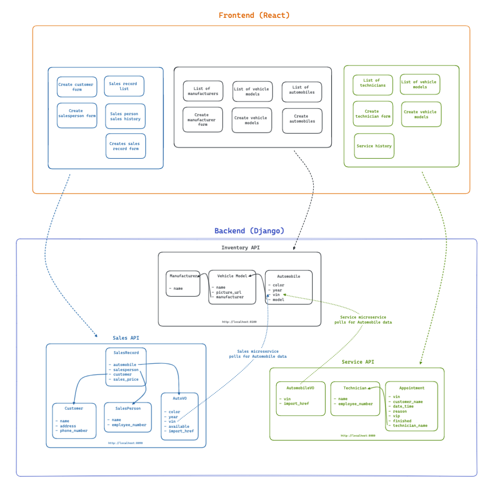

# CarCar

Team:

* Matthew Mai - Service microservice
* Anthony Pham - Sales Microservice

## Design

Welcome to CarCar - an application that allows a client to manage their car inventory, sales, and services.

CarCar is built using React for the frontend and utilizes microservices for architecture. Each functional area, such as inventory, sales, and service, is handled by a separate microservice - allowing for efficient development and scalability.

The inventory microservice allows for the management of cars in the inventory. Features that include adding, deleting, or updating car information. Through the polling mechanism, the application provides fast communication between the microservices - delivering the client information when neccessary.

The sales microservice tracks and manages car sales, including adding sales, viewing sales records, and management of sales personnel and potential customers.

The service microservice manages the technicians, scheduling of appointments, viewing appointment lists, and displaying the service history.

## CarCar Application Diagram



## Getting Started

Please have Docker Desktop downloaded before continuing with the following directions listed below.

#### Cloning the Repository

1. Inside your terminal, change to a directory that you would like to clone this project into.

2. In your terminal, type: ```git clone https://gitlab.com/matthewlmai/project-beta.git```

3. Switch into the project directory: ```cd project-beta```

#### Firing up Docker

After running the commands above, type and press enter after each command listed below:

1. ```docker volume create beta-data```

2. ```docker-compose build```

3. ```docker-compose up```

<details>
  <summary markdown="span">After successfully following the steps outlined above, you should see all 7 containers running.</summary>


</details>

## Navigating the Server

To navigate the server, type ```http://localhost:3000``` , this will take you to our Home Page. Within the Home Page is a navigation bar for easy access to each feature that we created. Below is a complete breakdown of the urls for each feature of the application.

## API Overview

### Inventory API

The Inventory API utilized RESTful methods that allows users to view a list of all manufacturers, create a new manufacturer, view all of the vehicle models, create a new vehicle model, list all of the automobiles, and create new automobiles.

**List manufacturers**

[http://localhost:3000/manufacturers/list/](link){:target="_blank"}

- List view of all the manufacturers inside the database

**Create manufacturer**

[http://localhost:3000/manufacturers/new/](link){:target="_blank"}

- Allows the user to create a new instance of a manufacturer
- The user inputs a manufacturer name that does not yet exist inside of the database

**List vehicle models**

[http://localhost:3000/models/list/](link){:target="_blank"}

- List view of all vehicle models in the database
- Delete a vehicle model instance from the database

**Create vehicle models**

[http://localhost:3000/models/new/](link){:target="_blank"}

- Allows the user to create a new instance of a vehicle model
- The user inputs a model name, a picture url of the vehicle, and selects a manufacturer from a dropdown

**List of automobiles**

[http://localhost:3000/automobile/list/](link){:target="_blank"}

- List view of all automobiles inside of the database
- Displayed on this list is the VIN, color, year, model, and manufacturer of the vehicle

**Create an automobile**

[http://localhost:3000/models/new/](link){:target="_blank"}

- Allows the user to create a new instance of an automobile
- The user inputs a color, year, VIN, and selects a model from a dropdown


## Service microservice

Explain your models and integration with the inventory
microservice, here.

## Sales microservice

Explain your models and integration with the inventory
microservice, here.
