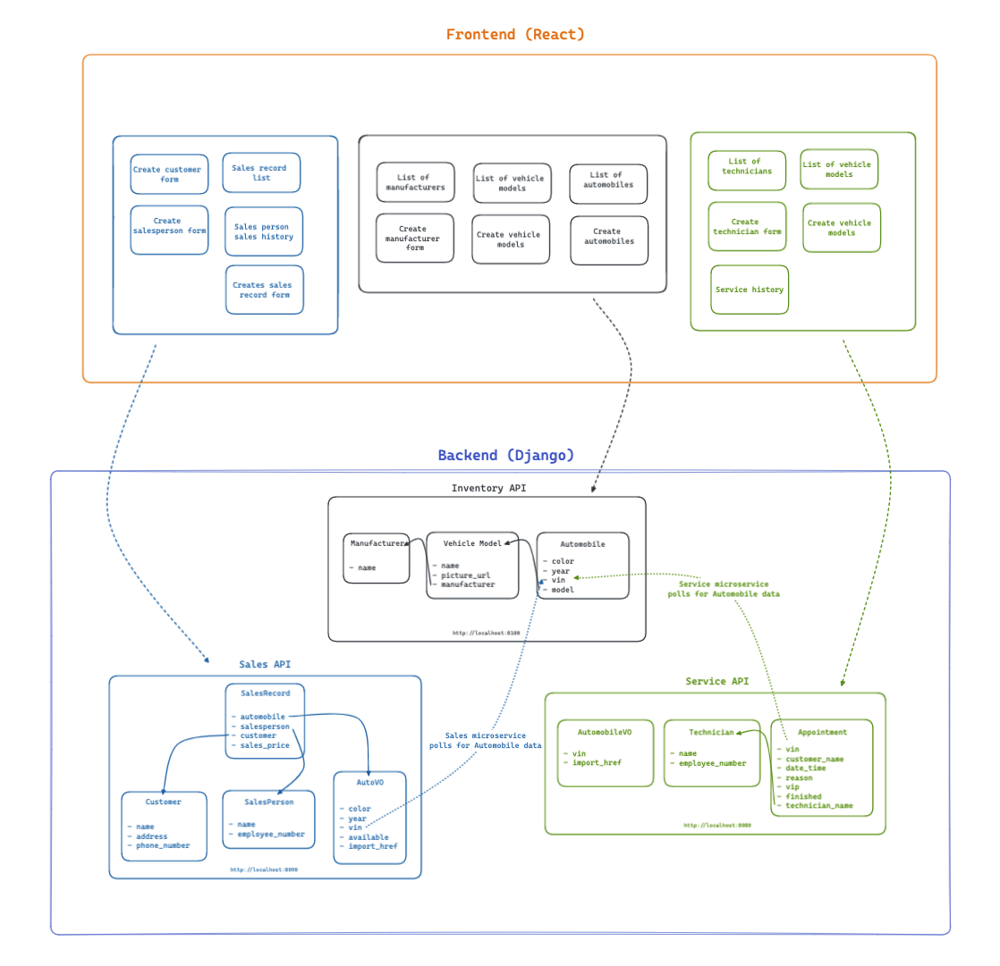
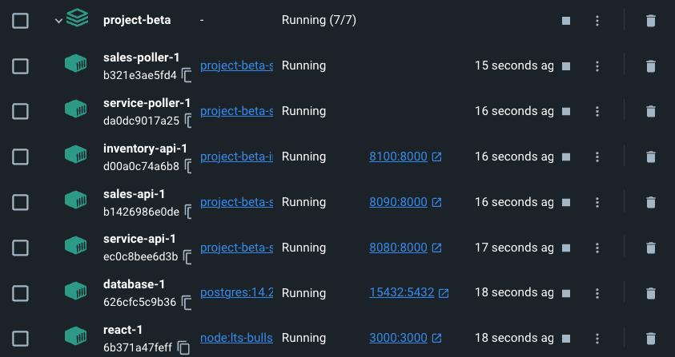

# CarCar

Team:

* Matthew Mai - Service microservice
* Anthony Pham - Sales Microservice

## Design

Welcome to CarCar - an application that allows a client to manage their car inventory, sales, and services.

CarCar is built using React for the frontend and utilizes microservices for architecture. Each functional area, such as inventory, sales, and service, is handled by a separate microservice - allowing for efficient development and scalability.

The inventory microservice allows for the management of cars in the inventory. Features that include adding, deleting, or updating car information. Through the polling mechanism, the application provides fast communication between the microservices - delivering the client information when neccessary.

The sales microservice tracks and manages car sales, including adding sales, viewing sales records, and management of sales personnel and potential customers.

The service microservice manages the technicians, scheduling of appointments, viewing appointment lists, and displaying the service history.

## CarCar Application Diagram



## Getting Started

Please have Docker Desktop downloaded before continuing with the following directions listed below.

#### Cloning the Repository

1. Inside your terminal, change to a directory that you would like to clone this project into.

2. In your terminal, type: ```git clone https://gitlab.com/matthewlmai/project-beta.git```

3. Switch into the project directory: ```cd project-beta```

#### Firing up Docker

After running the commands above, type and press enter after each command listed below:

1. ```docker volume create beta-data```

2. ```docker-compose build```

3. ```docker-compose up```

<details class="panel panel-info">
{: .panel-heading}
  <summary markdown="span">After successfully following the steps outlined above, you should see all 7 containers running.</summary>


</details>

## Service microservice

Explain your models and integration with the inventory
microservice, here.

## Sales microservice

Explain your models and integration with the inventory
microservice, here.
