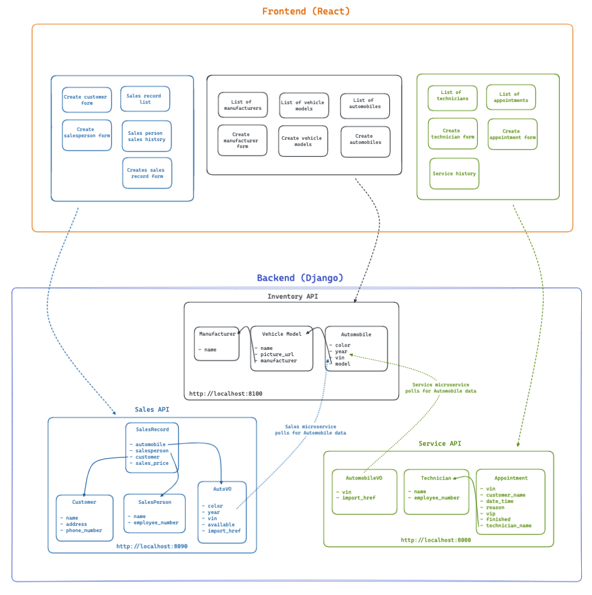

# CarCar

Team:

* Matthew Mai - Service microservice
* Anthony Pham - Sales Microservice

## Design

Welcome to CarCar - an application that allows a client to manage their car inventory, sales, and services.

CarCar is built using React for the frontend and utilizes microservices for architecture. Each functional area, such as inventory, sales, and service, is handled by a separate microservice - allowing for efficient development and scalability.

The inventory microservice allows for the management of cars in the inventory. Features that include adding, deleting, or updating car information. Through the polling mechanism, the application provides fast communication between the microservices - delivering the client information when neccessary.

The sales microservice tracks and manages car sales, including adding sales, viewing sales records, and management of sales personnel and potential customers.

The service microservice manages the technicians, scheduling of appointments, viewing appointment lists, and displaying the service history.

## CarCar Application Diagram



## Getting Started

Please have Docker Desktop downloaded before continuing with the following directions listed below.

#### Cloning the Repository

1. Inside your terminal, change to a directory that you would like to clone this project into.

2. In your terminal, type: ```git clone https://gitlab.com/matthewlmai/project-beta.git```

3. Switch into the project directory: ```cd project-beta```

#### Firing up Docker

After running the commands above, type and press enter after each command listed below:

1. ```docker volume create beta-data```

2. ```docker-compose build```

3. ```docker-compose up```

<details>
  <summary markdown="span">After successfully following the steps outlined above, you should see all 7 containers running.</summary>


</details>

## Navigating the Server

To navigate the server, type ```http://localhost:3000``` , this will take you to our Home Page. Within the Home Page is a navigation bar for easy access to each feature that we created. Below is a complete breakdown of the urls for each feature of the application.

## API Outline

### Inventory API

The Inventory API utilizes RESTful methods that allows users to view a list of all manufacturers, create a new manufacturer, view all of the vehicle models, create a new vehicle model, list all of the automobiles, and create new automobiles.

- **List manufacturers** http://localhost:3000/manufacturers/list/
    -  List view of all the manufacturers inside the database
- **Create manufacturer** http://localhost:3000/manufacturers/new/
    - Allows the user to create a new instance of a manufacturer
    - The user inputs a manufacturer name that does not yet exist inside of the database
- **List vehicle models** http://localhost:3000/models/list/
    - List view of all vehicle models in the database
    - Delete a vehicle model instance from the database
- **Create vehicle models** http://localhost:3000/models/new/
    - Allows the user to create a new instance of a vehicle model
    - The user inputs a model name, a picture url of the vehicle, and selects a manufacturer from a dropdown
- **List of automobiles** http://localhost:3000/automobile/list/
    - List view of all automobiles inside of the database
    - Displayed on this list is the VIN, color, year, model, and manufacturer of the vehicle
- **Create an automobile** http://localhost:3000/automobile/new/
    - Allows the user to create a new instance of an automobile
    - The user inputs a color, year, VIN, and selects a model from a dropdown

### Service API

The Service API utilizes RESTful methods that allows users to view a list of appointments that are incomplete (in-progress), create an appointment, a view of all technicians, creating an instance of a technician, and a service history that details all appointment (in-progress and completed)

- **List of appointments** http://localhost:3000/appointments/list/
    -  List view of all appointments that have not yet been completed inside the database
    -  List view of in-progress appointments display the VIN, customer name, date, time, technician, and reason for appointment.
    -  The user also has the ability to cancel or complete an appointment
- **Create an appointment** http://localhost:3000/appointments/new/
    - Allows the user to create a new instance of an appointment
    - The user inputs the VIN, customer name, the date and time of the scheduled appointment, reason for service, and selects a technician from a dropdown
- **List of technicians** http://localhost:3000/technicians/list/
    - List view of all technicians in the database
    - The list view displays the technician name and their respective employee number
- **Create a technician** http://localhost:3000/technicians/new/
    - Allows the user to create a new instance of a technician
    - The user inputs a technician name and an employee number
- **Service history** http://localhost:3000/services/history/
    - List view of a history of all of the service appointments inside of the database (in-progress appointments and completed appointments)
    - The service history has a search feature where a user is able to filter appointments by the VIN. The list view details the VIN, customer name, VIP status, date, time, technician, reason for service, and the current status of the appointment.

### Sales API

The Sales API utilizes RESTful methods that allows users to view a list of all sales, a list view of a salesperson’s sales record history, create a sales record, create an instance of a salesperson, and create new customers.

- **List of sales record** http://localhost:3000/salesrecords/
    -  List view of all sales records in the database
    -  List view of sales record display the sales person, their employee number, their customer, the VIN, and sales price
- **Salesperson history** http://localhost:3000/salesperson/history/
    - The user selects from a dropdown the salesperson they want to see the sales history for
    - This view shows a sales record for a specific salesperson in the database
- **Create a sales record** http://localhost:3000/salesrecords/new/
    - Allows the user to create a new instance of a sales record
    - The user selects an automobile, salesperson, and a customer form a dropdown and inputs the salesprice of the sale
- **Create a new salesperson** http://localhost:3000/salesperson/new/
    - Allows the user to create a new instance of a salesperson
    - The user inputs a salesperson name and their employee number
- **Create a new customer** http://localhost:3000/customer/new/
    - Allows the user to create a new instance of a customer
    - The user inputs the name of the customer, their address, and phone number

## Inventory Microservice RESTful API calls:

### Manufacturer
| Action  | Method   | URL   |
|---|---|---|
| List of Manufacturers | GET  | http://localhost:8100/api/manufacturers/  |
| Show Manufacturer Details  | GET  |  http://localhost:8100/api/manufacturers/:id/  |
| Create a Manufacturer  | POST   | http://localhost:8100/api/manufacturers/ |
| Update a Manufacturer  | PUT | http://localhost:8100/api/manufacturers/:id/  |
| Delete a Manufacturer  | DELETE  | http://localhost:8100/api/manufacturers/:id/  |

<details>
<summary markdown="span">POST, PUT: Creating and updating a manufacturer requires only the manufacturer’s name
</summary>
JSON body request:

```
{
 	"name": "Audi"
}
```
</details>

<details>
<summary markdown="span">GET, POST, PUT: The return value of creating, getting, and updating a single manufacturer is its name, href, and id
</summary>
Returns:

```
{
    "href": "/api/manufacturers/1/",
    "id": 1,
    "name": "Audi"
}
```
</details>

<details>
<summary markdown="span">GET: The list of manufacturers is a dictionary with the key *manufacturers* set to a list of manufacturers.
</summary>
Returns:

```
{
    "manufacturers": [
        {
            "href": "/api/manufacturers/1/",
            "id": 1,
            "name": "Audi"
        }
    ]
}
```
</details>

<br></br>

### Vehicle Models

| Action  | Method   | URL   |
|---|---|---|
| List of Vehicle Models | GET  | http://localhost:8100/api/models/  |
| Show a Vehicle Model Detail  | GET  |  http://localhost:8100/api/models/:id/  |
| Create a Vehicle Model  | POST   | http://localhost:8100/api/models/ |
| Update a Vehicle Model  | PUT | http://localhost:8100/api/models/:id/ |
| Delete a Vehicle Model  | DELETE  | http://localhost:8100/api/models/:id/  |

<details>
<summary markdown="span">POST, PUT: Creating and updating a vehicle model requires the name, picture_url and manufacturer id.
</summary>
JSON body request:

```
{
    "name": "R8",
    "picture_url": "https://www.kindpng.com/picc/m/590-5908844_audi-r8-png-transparent-png.png",
    "manufacturer_id": 1
}
```
</details>

<details>
<summary markdown="span">PUT: Updating a specific vehicle model can take the name and/or the picture_url.
</summary>
Returns:

```
{
    "name": "R8",
    "picture_url": "https://www.kindpng.com/picc/m/590-5908844_audi-r8-png-transparent-png.png"
}
```
</details>

<details>
<summary markdown="span">GET, POST, PUT: the detail of a specific vehicle model, or the return value from creating or updating a vehicle model, returns the model’s information and the manufacturer’s information
</summary>
Returns:

```
{
    "href": "/api/models/1/",
    "id": 1,
    "name": "R8",
    "picture_url": "https://www.kindpng.com/picc/m/590-5908844_audi-r8-png-transparent-png.png",
    "manufacturer": {
        "href": "/api/manufacturers/1/",
        "id": 1,
        "name": "Audi"
    }
}
```
</details>


<details>
<summary markdown="span">GET: a list of vehicle models returns a list of the detail information with the key "models"
</summary>
Returns:

```
{
    "models": [
        {
            "href": "/api/models/1/",
            "id": 1,
            "name": "R8",
            "picture_url": "https://www.kindpng.com/picc/m/590-5908844_audi-r8-png-transparent-png.png",
            "manufacturer": {
                "href": "/api/manufacturers/1/",
                "id": 1,
                "name": "Audi"
            }
        }
    ]
}
```
</details>

### Automobiles
| Action  | Method   | URL   |
|---|---|---|
| List of Automobiles | GET  | http://localhost:8100/api/automobiles/  |
| Show an Automobile Detail  | GET  |  http://localhost:8100/api/automobiles/:vin/  |
| Create an Automobile  | POST   | http://localhost:8100/api/automobiles/ |
| Update an Automobile l  | PUT | http://localhost:8100/api/automobiles/:vin/ |
| Delete an Automobile   | DELETE  | http://localhost:8100/api/automobiles/:vin/  |

<details>
<summary markdown="span">POST: You can create an automobile with its color, year, VIN, and the id of the vehicle model.
</summary>
JSON body request:

```
{
    "color": "black",
    "year": 2022,
    "vin": "1C3CC5FB2AN120174",
    "model_id": 1
}
```
</details>

<details>
<summary markdown="span">GET: As noted, you query an automobile by its VIN. For example, you would use the URL
http://localhost:8100/api/automobiles/1C3CC5FB2AN120174/
to get the details for the car with the VIN "1C3CC5FB2AN120174". The details for an automobile include its model and manufacturer.
</summary>
Returns:

```
{
    "href": "/api/automobiles/1C3CC5FB2AN120174/",
    "id": 1,
    "color": "black",
    "year": 2022,
    "vin": "1C3CC5FB2AN120174",
    "model": {
        "href": "/api/models/1/",
        "id": 1,
        "name": "R8",
        "picture_url": "https://www.kindpng.com/picc/m/590-5908844_audi-r8-png-transparent-png.png",
        "manufacturer": {
            "href": "/api/manufacturers/1/",
            "id": 1,
            "name": "Audi"
        }
    }
}
```
</details>

<details>
<summary markdown="span">PUT: You can update the color and/or year of an automobile.
</summary>
JSON body request:

```
{
    "color": "white",
    "year": 2021
}
```
</details>

<details>
<summary markdown="span">GET: a list of automobiles returns a dictionary with the key "autos" set to a list of automobile information
</summary>
Returns:

```
{
    "autos": [
        {
            "href": "/api/automobiles/1C3CC5FB2AN120174/",
            "id": 1,
            "color": "black",
            "year": 2022,
            "vin": "1C3CC5FB2AN120174",
            "model": {
                "href": "/api/models/1/",
                "id": 1,
                "name": "R8",
                "picture_url": "https://www.kindpng.com/picc/m/590-5908844_audi-r8-png-transparent-png.png",
                "manufacturer": {
                    "href": "/api/manufacturers/1/",
                    "id": 1,
                    "name": "Audi"
                }
            }
        }
    ]
}
```
</details>


## Service microservice

The Service microservice has three models: AutomobileVO, Technician, and Appointment. The AutomobileVO model is a value object which is a representation of the Automobile model in the ***Inventory microservice***. Through the use of a polling mechanism, we are able to poll data from the Automobile model in the Inventory microservice into the AutomobileVO in the Service microservice.

The ```AutomobileVO``` model contains the ```vin``` and ```import_href``` fields. This model is a value object that consistently polls for data from the Automobile model in the Inventory microservice.

The ```Technician``` model contains the ```technician_name``` and ```employee_number``` fields. This model is a source of information that stores data about technicians.

The ```Appointment``` model contains the ```vin```, ```customer_name```, ```date_time```, ```reason```, ```vip```, ```finished```, and ```technician_name``` fields. This model is a source of information that stores data about appointments. The ```vin``` field stores the VIN number of the associated vehicle. The ```vin``` field is not set as a foreign key because clients who do not own a vehicle from the inventory should also be able to make an appointment for services. The ```technician_name``` field is a foreign key to the ```Technician``` model - many appointments can have a single technician. The ```vip``` and ```finished``` fields are used to check for their status.

**Service Microservice RESTful API calls:**
| Action  | Method   | URL   |
|:---:|:---:|:---:|
| List of technicians| GET  | http://localhost:8080/api/technicians/  |
| Create new technicians  | POST  |  http://localhost:8080/api/technicians/  |

<details>
  <summary markdown="span">GET: List of technicians</summary>
Returns:

```
{
    "technicians": [
        {
            "technician_name": "Joshua Elder",
            "employee_number": 111222,
            "id": 1
        },
    ]
}
```

</details>

<details>
  <summary markdown="span">POST: Creating a new technician request</summary>
JSON body request:

```
{
	"technician_name": "Joshua Elder",
	"employee_number": "111222"
}
```

Returns:

```
{
	"technician_name": "Joshua Elder",
	"employee_number": "111222,"
	"id": 1
}
```
</details>

| Action  | Method   | URL   |
|:---:|:---:|:---:|
| List of appointments  | GET   | http://localhost:8080/api/appointments/ |
| Create new appointments | POST | http://localhost:8080/api/appointments/   |
| Show appointment details  | GET  | http://localhost:8080/api/appointments/:id/  |
| Edit a specific appointment | PUT  | http://localhost:8080/api/appointments/:id/ |
| Delete a specific appointment | DELETE  | http://localhost:8080/api/appointments/:id/ |

<details>
  <summary markdown="span">GET: List of appointments</summary>
Returns:

```
{
    "appointments": [
        {
            "vin": "1E3EC5FB2AN120176",
            "customer_name": "John Doe",
            "date_time": "2023-01-24T09:21:32.096450+00:00",
            "reason": "Tire replacement for left/right rear tires",
            "vip": true,
            "finished": false,
            "technician_name": {
                "technician_name": "Joshua Elder",
                "employee_number": 111222,
                "id": 1
            },
            "id": 1
        },
    ]
}
```
</details>

<details>
  <summary markdown="span">POST: Creating a new appointment request</summary>
JSON body request:

```
{
    "vin": "1C3CC5FB2AN120174",
    "customer_name": "John Doe",
    "date_time": "2023-01-24T09:21:32.096450+00:00",
    "reason": "Tire replacement for left/right rear tires",
    "technician_name": "Joshua Elder"
}
```

Returns:

```
{
	"vin": "1C3CC5FB2AN120174",
	"customer_name": "John Doe",
	"date_time": "2023-01-24T09:21:32.096450+00:00",
	"reason": "Tire replacement for left/right rear tires",
	"vip": true,
	"finished": false,
	"technician_name": {
		"technician_name": "Joshua Elder",
		"employee_number": 111222,
		"id": 1
	},
	"id": 1
}
```
</details>

<details>
  <summary markdown="span">GET: Show a specific appointment</summary>
Returns:

```
{
	"vin": "1C3CC5FB2AN120174",
	"customer_name": "John Doe",
	"date_time": "2023-01-24T09:21:32.096450+00:00",
	"reason": "Tire replacement for left/right rear tires",
	"vip": true,
	"finished": false,
	"technician_name": {
		"technician_name": "Joshua Elder",
		"employee_number": 111222,
		"id": 1
	},
	"id": 1
}
```
</details>

</details>

<details>
  <summary markdown="span">PUT: Edit a specific appointment</summary>
JSON body request:

```
{
    "vin": "1C3CC5FB2AN120174",
    "customer_name": "John Doe",
    "date_time": "2023-01-24T09:21:32.096450+00:00",
    "reason": "Tire replacement for all tires",
    "technician_name": "Joshua Elder"
}
```

Returns:
```
{
	"vin": "1C3CC5FB2AN120174",
	"customer_name": "John Doe",
	"date_time": "2023-01-24T09:21:32.096450+00:00",
	"reason": "Tire replacement for all tires",
	"vip": true,
	"finished": false,
	"technician_name": {
		"technician_name": "Joshua Elder",
		"employee_number": 111222,
		"id": 1
	},
	"id": 1
}
```
</details>

<details>
  <summary markdown="span">DELETE: Delete a specific appointment</summary>
Returns:

```
{
	"deleted": true
}
```
</details>


## Sales microservice

The Sales Microservice has four models: AutoVO, SalesPerson, Customer and SalesRecord. The AutoVO model is a value object which is a representation of the Automobile Model in the ***Inventory Microservice***.

The ```AutoVO``` model contains the ```color```, ```year```, ```vin```, ```available```, ```import_href``` fields.

The ```SalesPerson``` model contains the ```name``` and ```employee_number``` fields to store a sales employee information in the database.

The ```Customer``` model contains the ```name```, ```address```,  and ```phone_number``` field to store customer information in the database.

The ```SalesRecord``` model contains a  ```automobile``` field which is a foreign key to the ```AutoVO``` model as there can be many automobiles to record a sale for. It contains a ```salesperson``` field  which is a foreign key to the ```SalesPerson``` model as we need to have an existing SalesPerson to be able to record a sales record. It also contains a ```customer``` field which is a foreign key to the ```Customer``` model as we need to have an existing customer to be able to record a sales record. Lastly, it has a ```sales_price``` field to record the price the automobile was sold for.

An extra note: the AutoVO model has an additional property that the Automobile Model does not, which is the ***Available*** property. This will allow us to filter only vehicles that are available, meaning those that have not been sold, in order to create a Sales Record and avoid any confusion while selling a car. A vehicle created in the AutoVO model has a default available status set to **"True"** until a Sales Record is created with that vehicle vin.


There is a ***poll*** function that allows the Sales microservice to poll the Inventory every 60 seconds to make sure the Sales Microservice data is up to date. Every time the Sales Microservice polls the Inventory API, it either updates or creates an AutoVO instance.


In order to create a Sales Record, an automobile, customer and salesperson will have to be created. The Sales Record uses the ```href``` variable of the Automobile model as the value. Please refer to the example below.

The back-end of the Sales Microservices can be found following this path ***sales/api/sales_rest/views.py***. There is a view function for each model to properly ensure the back-end data is being created and stored properly. There is also an encoder for each view function to be able to parse through the data. For your convenience, we’ve added the required JSON Body beneath the RESTFul API table to be able to test these API calls through the Insomnia APP.


### Sales Microservice RESTful API calls

| Action  | Method   | URL   |
|---|---|---|
| List of all Sales People | GET  | http://localhost:8090/api/salesperson  |
| Show Sales Person Details  | GET  |  http://localhost:8090/api/salesperson/:id/  |
| Create a Sales Person  | POST   | http://localhost:8090/api/salesperson/ |

<details>
<summary markdown="span">POST: Creating a sales person requires the name and employee number.
</summary>
JSON request body:

```
{
	"name": "John Smith",
	"employee_number": "1112"
}
```
</details>

<details>
<summary markdown="span">POST, PUT: The return values of creating and getting a single sales person is the name, employee_number and id.
</summary>
Returns:

```
{
	"name": "Anthony P",
	"employee_number": "1111",
	"id": 1
}
```
</details>

<details>
<summary markdown="span">GET: The return value of getting a list of sales people is a dictionary with the key *sales_staff* set to a list of sales people.
</summary>
Returns:

```
{
	"sales_staff": [
		{
			"name": "Paul K",
			"employee_number": "1112",
			"id": 2
		},
		{
			"name": "Anthony P",
			"employee_number": "1111",
			"id": 1
		}
	]
}
```
</details>

| Action  | Method   | URL   |
|---|---|---|
| List all Customers  | GET | http://localhost:8090/api/customers/   |
| Show a Customer Details  | GET  | http://localhost:8090/api/customers/:id/  |
| Create a Customer  | POST  | http://localhost:8090/api/customers/ |

<details>
<summary markdown="span">POST: Creating a Customer requires the name, address and phone number.
</summary>
JSON body request:

```
{
	"name": "Kenny G",
	"address": "1234 Main St, Local City, CA",
	"phone_number": "9995555555"
}
```
</details>

<details>
<summary markdown="span">GET, POST: The return values of creating and getting a customer will return the name, address, phone_number and id.
</summary>
Returns:

```
{
	"name": "Kenny G",
	"address": "1234 Main St, Local City, CA",
	"phone_number": "9995555555",
	"id": 4
}
```
</details>

<details>
<summary markdown="span">GET: The return value of getting a list of customers is a dictionary with the key *customers* set to a list of customers.
</summary>
Returns:

```
{
	"customers": [
		{
			"name": "Alex P",
			"address": "1234 Main Street, Santa Anita",
			"phone_number": "7148081452",
			"id": 1
		},
		{
			"name": "Randy T",
			"address": "1221 85th Street, Santa Ana",
			"phone_number": "7143342111",
			"id": 3
		}

	]
}
```
</details>

| Action  | Method   | URL   |
|---|---|---|
| List all Sales Records | GET  | http://localhost:8090/api/salesrecords/ |
| Show a Sales Record Detail  | GET  | http://localhost:8090/api/salesrecords/:id/ |
| Create a Sales Record  | POST   | http://localhost:8090/api/salesrecords/  |

<details>
<summary markdown="span">POST: Creating a sales record requires the automobile which is an href from the Automobile model, the salesperson’s name, the customer and the sales_price
</summary>
JSON body request:

```
{
	"automobile": "/api/automobiles/5N1ED28T4YC520944/",
	"salesperson": "Paul K",
	"customer": "Roo P",
	"sales_price": "60000"
}
```
</details>

<details>
<summary markdown="span">GET: The return of getting a single sales record include the details of the automobile, salesperson, customer and sales_price along with the sales_record id which is generated per each sales record created.
</summary>
Returns:

```
{
	"automobile": {
		"color": "Blue",
		"year": 2013,
		"vin": "1A23456789",
		"available": false,
		"import_href": "/api/automobiles/1A23456789/"
	},
	"salesperson": {
		"name": "Paul K",
		"employee_number": "1112",
		"id": 2
	},
	"customer": {
		"name": "Alex P",
		"address": "1234 Main Street, Santa Anita",
		"phone_number": "7138081452",
		"id": 1
	},
	"sales_price": "65000",
	"id": 2
}
```
</details>

<details>
<summary markdown="span">GET: The return of getting all the sales records is a dictionary with the key *sales* set to a list of sales records.
</summary>
Returns:

```
{
	"sales": [
		{
			"automobile": {
				"color": "gray",
				"year": 2014,
				"vin": "1C3CC5FB2AN120174",
				"available": false,
				"import_href": "/api/automobiles/1C3CC5FB2AN120174/"
			},
			"salesperson": {
				"name": "Anthony P",
				"employee_number": "1111",
				"id": 1
			},
			"customer": {
				"name": "Kenny G",
				"address": "1234 Main St, Local City, CA",
				"phone_number": "9995555555",
				"id": 4
			},
			"sales_price": "51000",
			"id": 1
		}
	]
}
```
</details>
